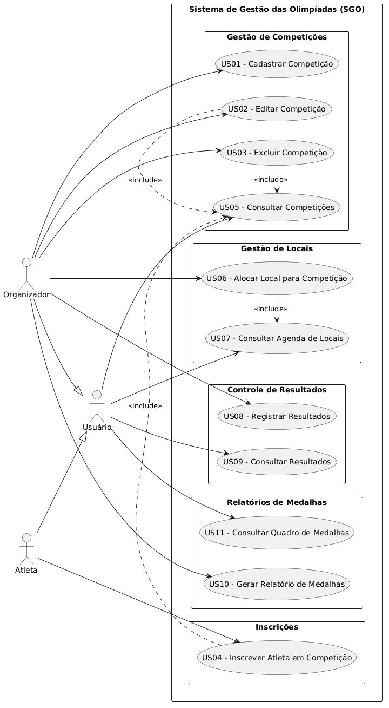
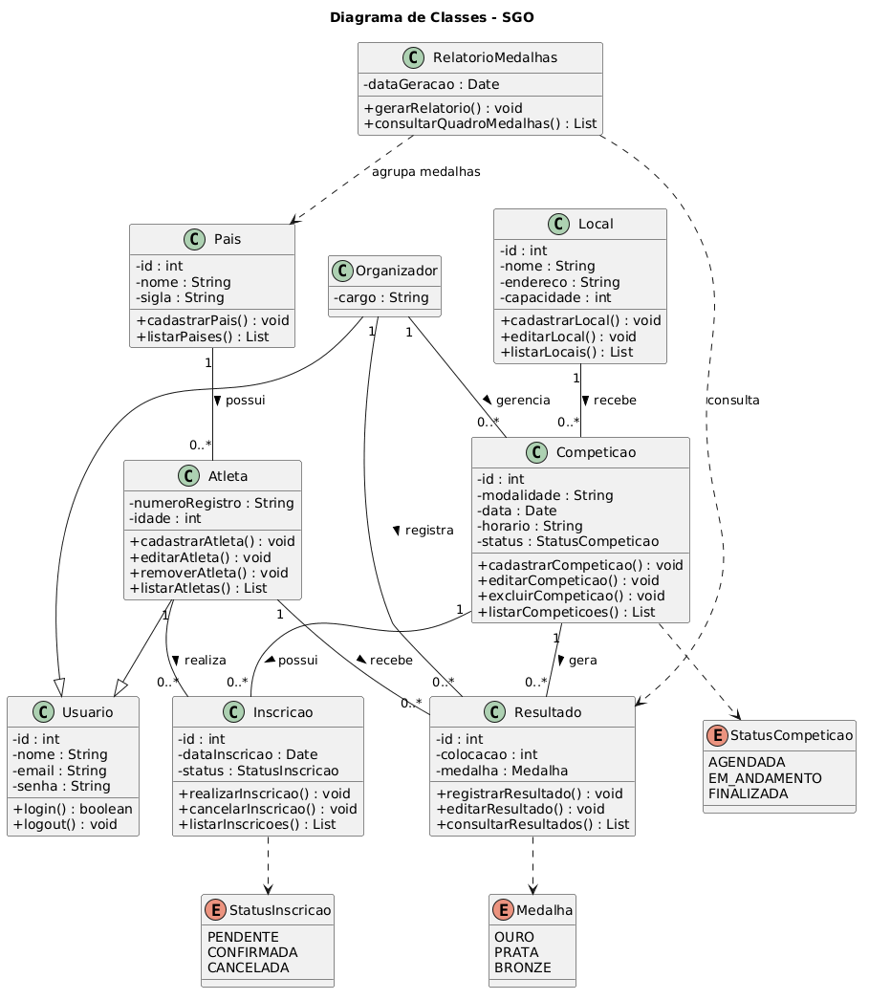
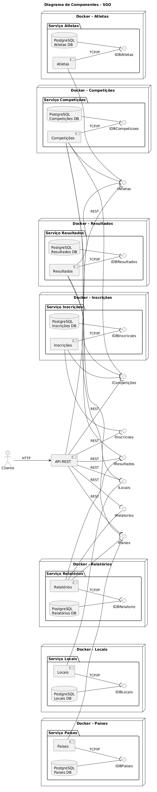
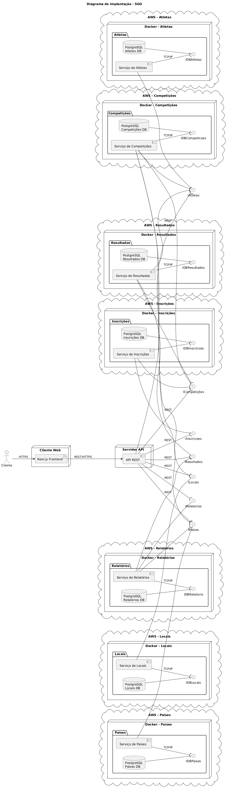
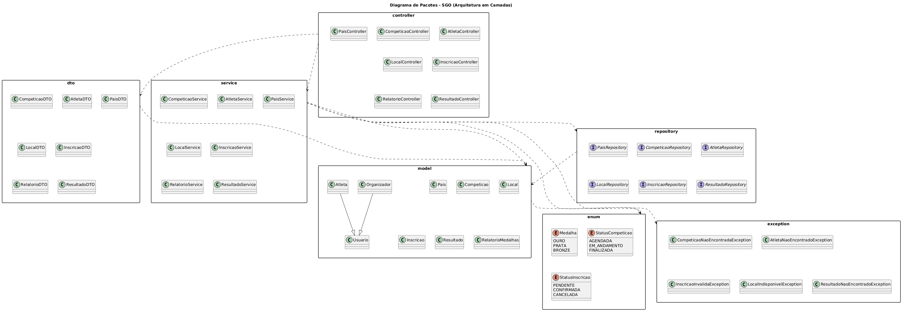
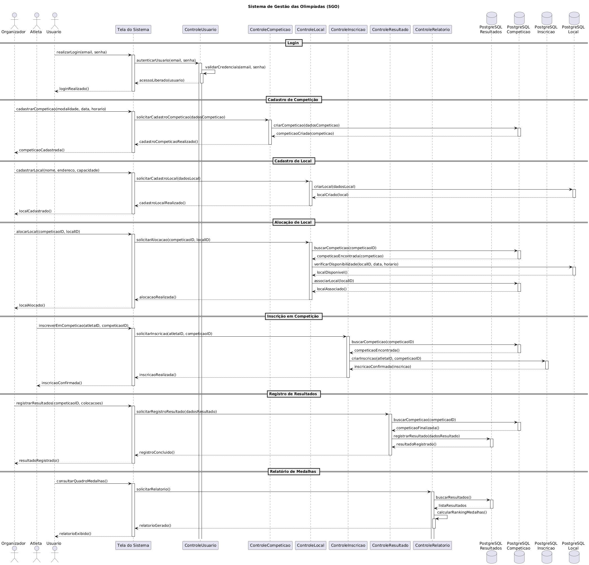

# Sistema de Gestão das Olimpíadas (SGO)

Com a chegada das Olimpíadas, é necessário um sistema para coordenar os diferentes aspectos do evento. O SGO permite gerenciar competições, inscrições de atletas, alocação de locais, registro de resultados e geração de relatórios.

**Visão Geral**: aplicação organizada em camadas (controller, service, repository, model, dto, enum, exception) seguindo arquitetura limpa para facilitar manutenção e testes.

---
<!-- Inserindo conteúdo de USER-STORY.md para referência rápida -->

## Histórias de Usuário — Sistema de Gestão das Olimpíadas (SGO)

### US01 — Cadastrar Competição
Como Organizador, quero cadastrar competições com modalidade, data, horário e local para organizar os eventos das Olimpíadas.

### US02 — Editar Competição
Como Organizador, quero editar informações de uma competição para corrigir dados cadastrados.

### US03 — Excluir Competição
Como Organizador, quero excluir competições cadastradas para remover eventos cancelados.

### US04 — Inscrever Atleta em Competição
Como Atleta, quero me inscrever em competições para participar das Olimpíadas.
- O atleta só pode representar um país por modalidade

### US05 — Consultar Competições
Como Atleta, quero visualizar as competições disponíveis para escolher em quais participar.

### US06 — Alocar Local para Competição
Como Organizador, quero alocar locais para competições para evitar conflitos de horário.

### US07 — Consultar Agenda de Locais
Como Organizador, quero consultar a agenda dos locais para verificar disponibilidade.

### US08 — Registrar Resultados
Como Organizador, quero registrar os resultados das competições para definir medalhistas.

### US09 — Consultar Resultados
Como Atleta, quero consultar os resultados das competições para acompanhar meu desempenho.

### US10 — Gerar Relatório de Medalhas
Como Organizador, quero gerar relatórios de medalhas para acompanhar o desempenho dos países.

### US11 — Consultar Quadro de Medalhas
Como Atleta, quero visualizar o quadro de medalhas para acompanhar os resultados das Olimpíadas.

## Documentação do Sistema

- **Arquitetura:** Camadas separadas em `controller`, `service`, `repository`, `model` e `dto`. Exceções e enums localizados em pacotes próprios.
- **Principais componentes:** Competição, Atleta, País, Local, Inscrição, Resultado, Relatório de Medalhas, Usuário/Organizador.
- **Regras de negócio importantes:** um atleta representa um país por modalidade; locais não podem ser alocados em conflitos de horário; inscrições podem ter status (PENDENTE, CONFIRMADA, CANCELADA).
- **Fluxos principais:** cadastro/edição/exclusão de competições, inscrição de atletas, alocação de locais, registro de resultados e geração de relatórios.

## Diagramas

As imagens dos diagramas geradas a partir dos arquivos PlantUML estão na pasta `images`. Abaixo estão os diagramas principais do projeto:

- **Diagrama de Caso de Uso**

	

- **Diagrama de Classes**

	

- **Diagrama de Componentes**

	

- **Diagrama de Implantação**

	

- **Diagrama de Pacotes**

	

- **Diagrama de Sequência**
	

## Onde encontrar mais

- Arquivos PlantUML: `diagramas/` (ex.: `diagramas/diagrama-caso-uso.puml`, `diagramas/diagrama-classe.puml`).
- Imagens dos diagramas: `images/`.

